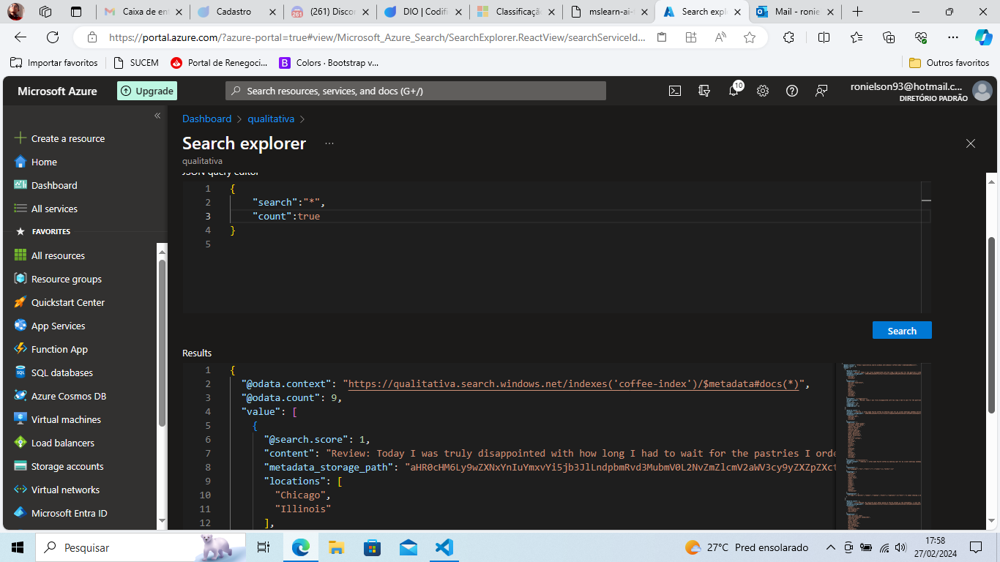
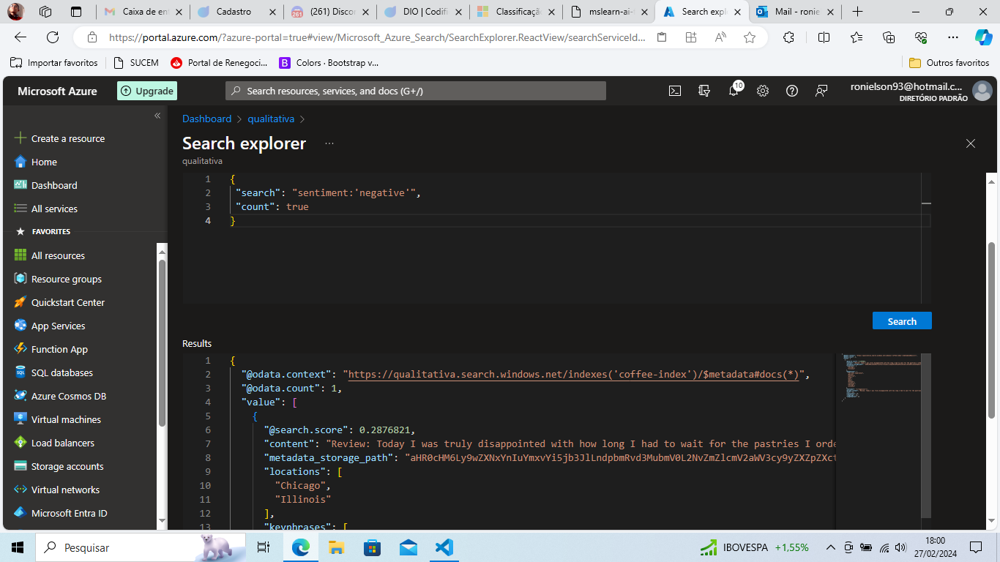

# Indice de Pesquisa de IA
Vamos utilizar alguns recursos da IA com base em alguns dados levantados, 
seremos capazes de obter alguns insights sobre as experiências dos usuários.

Temos que criar três recursos:
  <ul>
    <li> Azure IA Search</li>
    <li> Azure IA Services</li>
    <li> Storage Account</li>
    </ul>

## Criando o Azure IA Search

1 - Em criar um recurso, pesquise por Azure IA Search e selecione para criar. 
2 - Preencha todos os campos e lembre-se de trocar o <b>piercing tier</b> deixando-o com <b>basic.</b>Tudo preenchido corretamente, clique em revisão + criação. 
observe que no dashboard do recursos aparece as opções
<ul>
    <li>adicionar índices</li>
    <li>importar dados</li>
    <li>pesquisar índices criados</li>
</ul>

## Criando o Azure IA Services 
1 - Em criar um recurso, pesquise por Azure IA Services e selecione para criar. 
2 - Preencha todos os campos e lembre-se que todo recurso pertence há um grupo e não selecione a região do    tendo em vista que o custo será mais alto.

## Criando o Storage Account
1 - Em criar um recurso, pesquise por Storage Account e selecione para criar. 
2 - Preencha todos os campos, o nome da conta de armazenamento tem que ser único e a redundância deve ser trocada para LRS.

## Criando Container

1 - No menu lateral esqurdo selecione container e depois +container  
2 - Após criar o container faça o download dos <a href="https://aka.ms/mslearn-coffee-reviews">dados</a> 
3 - Clique no container criado e faça o upload de todos os arquivos baixados anteriormente.

## Indexando Documentos 

1 - No seu Search Services, clique em importar dados  
2 - Selecione Armazenamento Bob Azure e preencha todos os dados de acordo com a <a href="https://microsoftlearning.github.io/mslearn-ai-fundamentals/Instructions/Labs/11-ai-search.html">documentação</a>  
3 - Como teremos muitos dados para preencher, devemos seguir a risca o que a documentação oficial nos indica.

## Resultado

1 - Após seguir todos os passos, você poderá realizar consultas em formato JSON e terá esses resultados:
Resultado 1:

Resultado 2:

